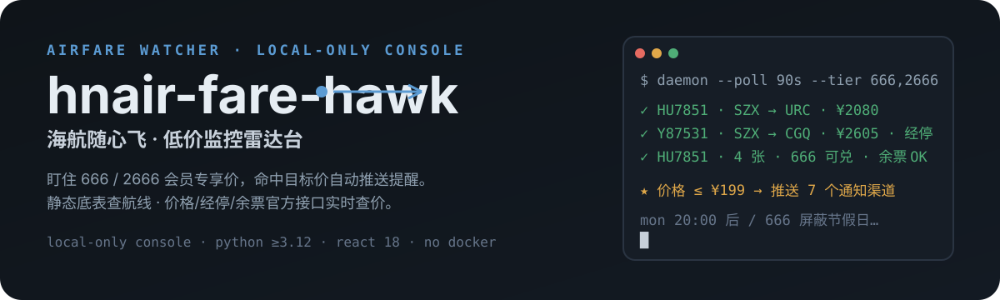
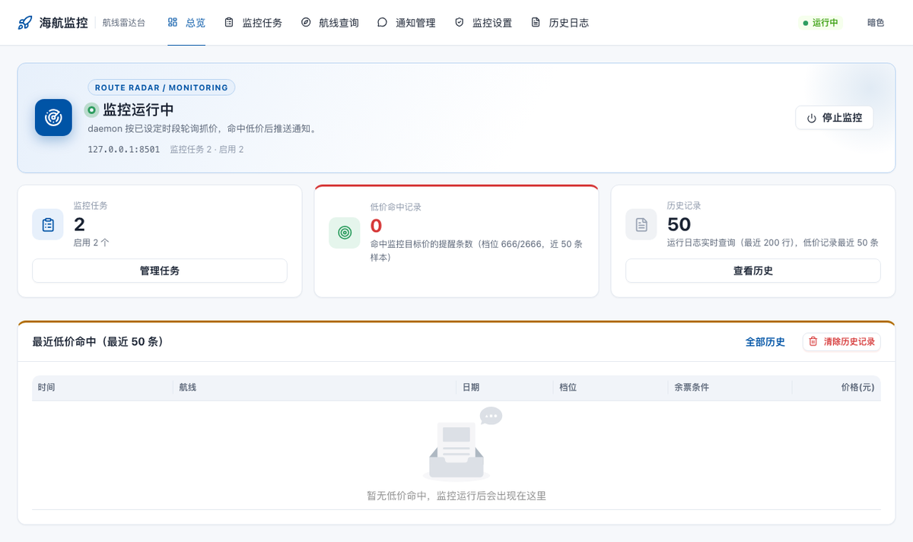
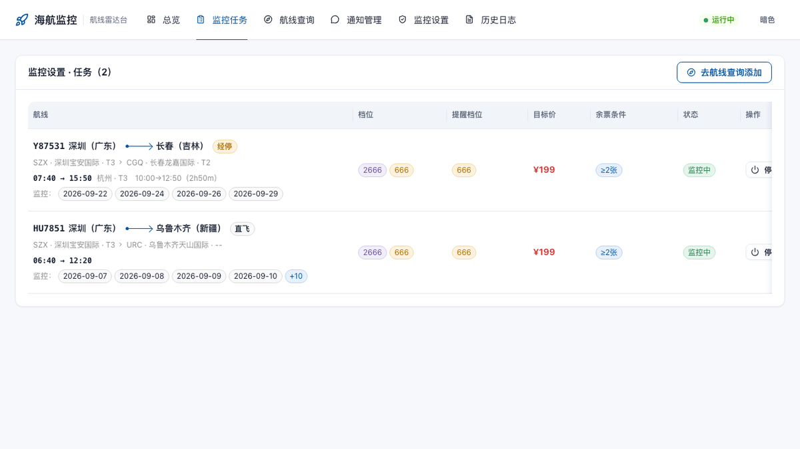
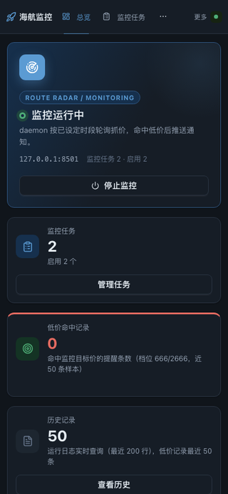
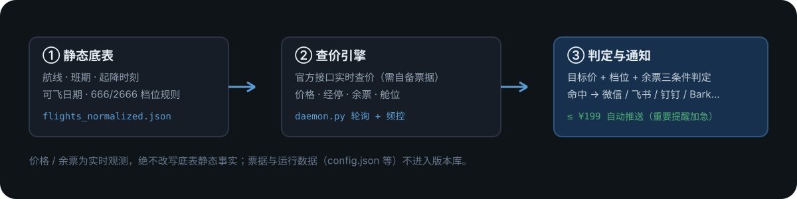

 # hnair-fare-hawk · 海航随心飞低价雷达
 
 <p align="center">
   
 </p>
 
 <p align="center">
 
  
 
   
 </p>
 
 盯住海航随心飞 **666 / 2666 会员专享价**：底表给出航线、班期与可飞日期，价格、经停和余票由官方接口**实时查价**，命中目标价（默认 ≤ ¥199）自动推送到微信 / 飞书等渠道。
 
 > 只读监控与提醒，**不**自动购票 / 锁票 / 付款。请自备抓包票据并遵守航司服务条款（见[限制与合规](#限制与合规)）。
 
 ## 截图
 
 <p align="center">
   
 </p>
 
 <p align="center">
   
 </p>
 
 <p align="center">
   
 </p>
 
 ## 为什么这样设计
 
 - **静态与实时分离**：航线 / 班期 / 可飞日期 / 档位规则来自本地底表；价格 / 经停 / 余票 / 舱位永远实时查询，且**绝不回写**底表静态事实。
 - **档位×日期规则**：666 档屏蔽春运 / 五一 / 暑运 / 十一，2666 档仅屏蔽春运 / 暑运；规则单一事实源（`data/sediment/tier_block_rules.json`），改数据即可，不动代码。
 - **状态三通道**：运行状态 = 文字 + 圆点 + 颜色，不依赖单一信号；浅 / 暗主题，移动端可用。
 - **防风控**：前端限频锁 + 后端最小间隔 + 429 自动退避；监控频率可按时段配置。
 - **低成本**：纯标准库 HTTP 后端 + React 单页前端，无数据库、无 Docker，个人电脑即可常驻。
 
 <p align="center">
   
 </p>
 
 ## 快速开始
 
 ```bash
 git clone https://github.com/<your-username>/hnair-fare-hawk.git && cd hnair-fare-hawk
 python3 -m venv .venv && source .venv/bin/activate
 pip install -r requirements.txt
 
 cd web && pnpm install && pnpm build && cd ..
 
 # 启动（Web 控制台仅监听 127.0.0.1:8501）
 .venv/bin/python web_api.py
 
 # 另开终端启动监控循环
 .venv/bin/python daemon.py
 ```
 
 打开 http://127.0.0.1:8501：
 
 1. **“监控设置 → 抓包票据”**粘贴你在海航官网/App 抓取的查询接口 cURL（普通票价入口 `airLowFareSearch`、PLUS 专享入口 `ffl/airLowFareSearch`，抓一份即可自动派生另一档）。票据与令牌仅存本地 `config.json`，**不入版本库**。
 2. **“航线查询”**选出发 / 到达 / 日期，把心仪航班“转为监控任务”，设置目标价与余票条件。
 3. 命中低价后按已配置渠道推送（微信 Server酱 / 飞书 / 企业微信 / 钉钉 / Bark / ntfy）。
 
 > 票据与令牌、任务、运行日志（`config.json` / `tasks.json` / `*.log` 等）均被 `.gitignore` 排除；请勿提交任何含 Cookie / token 的文件。
 
 ## 通知渠道
 
 | 渠道 | 说明 |
 | --- | --- |
 | 微信（Server酱） | 服务号推送，重要提醒可加急 |
 | 飞书 | 机器人消息 + 交互卡片确认回执（加急） |
 | 企业微信 / 钉钉 | 群机器人 Webhook |
 | Bark / ntfy | 手机端轻量推送 |
 
 配置步骤见 `docs/notify_channels_guide.md`。
 
 ## 目录速览
 
 ```text
 web/                  React 18 + Ant Design 5 控制台（Vite 构建）
 web_api.py            轻量 Web API（标准库 http.server，127.0.0.1:8501）
 daemon.py             监控循环：轮询查价 → 判定 → 通知
 backend/              fetcher（官方查价）/ sediment（底表）/ channels（多渠道）/ feishu_ws（卡片回执）
 data/sediment/        底表静态数据与档位规则（入版本库）
 scripts/sedimentation/  数据校正与非票据全量自扫管线
 tests/                pytest 测试集
 docs/                 通知渠道与估价可行性说明
 ```
 
 ## 限制与合规
 
 - 仅本机运行，绑定 127.0.0.1，不做公网暴露。
- 实时查价依赖你**自行抓取的官方接口票据**；接口与签名实现随项目提供，但票据与令牌需由你自行抓取维护。本项目不提供任何绕过验证或风控的手段。
 - 底表数据来自公开产品信息整理，价格与余票仅作个人监控参考。
 - 请遵守海航及航司的服务条款与当地法律；因使用本工具产生的任何后果由使用者自行承担。
 
 ## License
 
 [MIT](./LICENSE) © 2026 Shrek Wu（晨光）
 
