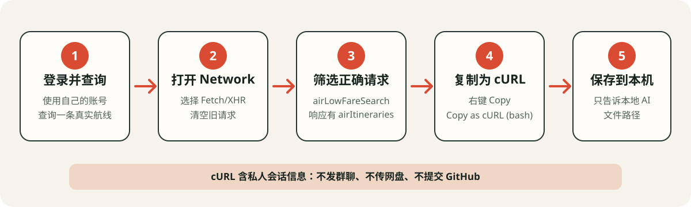

# 收到项目后，只看这一份

## 你能用它做什么

在 Windows 或 macOS 电脑上选择出发日期、出发地、到达地和目标票面价。电脑会在你设置的时段内随机查价，发现符合条件的航班后把日期、城市、航班号和票面价发送到你的微信。

程序只查询和提醒，不会替你购买。电脑关机、休眠、断网或后台被关闭时，监控会暂停。

## 你只需要亲自做三件事

1. 用你自己的海航账号生成一份当前有效的查询请求。
2. 用你自己的微信申请 Server酱 SendKey。
3. 在页面选择日期、航线和价格，点击“添加任务”和“启动监控”。

安装 Python、安装依赖、写入本地配置、启动程序和检查结果，都可以交给能操作本机终端的 AI 编程工具。

> 浏览器里的普通聊天 AI 通常不能操作你的电脑。请使用已经打开本项目文件夹、并且可以运行本机终端命令的 AI 编程工具。

---

## 第一步：准备你自己的海航查询请求

这一步必须由你本人操作，因为发布包不会包含作者的账号会话。

### 用 Chrome 获取请求

Windows 和 macOS 都建议使用 Chrome：

1. 打开海航官方移动端网页，使用你自己的账号登录。
2. 打开开发者工具：
   - Windows：按 `F12` 或 `Ctrl + Shift + I`。
   - macOS：按 `Option + Command + I`。
3. 点击“网络”或 `Network`。
4. 点击 `Fetch/XHR`，再点击清空按钮，清掉旧请求。
5. 回到左侧网页，正常查询一次你确实能看到航班价格的日期和航线。
6. 在请求列表的过滤框输入 `airLowFareSearch`。
7. 点击候选请求，在“载荷/Payload”中确认能看到 `originDestinations`，在“响应/Response”中确认能看到 `airItineraries`。只有这种请求才是本项目需要的完整查价请求。
8. 右键点击这条请求，选择“复制/Copy”→“复制为 cURL（bash）/Copy as cURL (bash)”。
9. 把复制到的全部内容保存成一个本机文本文件，例如：
   - Windows：`C:\Users\你的用户名\Documents\hna-normal.txt`
   - macOS：`~/Documents/hna-normal.txt`



### 普通票价和 PLUS 专享价

- 只监控普通票价：在普通机票查询入口操作一次，保存一份请求。
- 只监控 PLUS 专享价：从 PLUS 专享入口操作一次，保存一份请求。
- 两种都监控：分别保存两份请求，不能把同一份请求同时当成两种票价。

你不需要为每个日期和城市重新抓一次。程序会在本地复制这份请求模板，并替换任务中的出发三字码、到达三字码和日期。请求失效、重新登录或官方接口变化后，才需要重新做本步骤。

### 怎样判断复制的是正确请求

必须同时满足：

- 请求名称包含 `airLowFareSearch`。
- 请求体中有 `data.originDestinations`。
- 响应中有 `data.originDestinations[0].airItineraries`。
- 这条请求是你刚刚执行实际航班查询时产生的，而不是首页推荐、价格趋势或广告请求。

如果响应为空、要求验证码或提示登录失效，请先回到官方页面完成验证，再重新复制。不要尝试绕过验证码或平台安全校验。

### 安全提醒

cURL 文本通常含有账号会话、Cookie、token 和签名。它相当于一把临时钥匙：

- 只保存在自己的电脑。
- 只把“本地文件路径”告诉本地 AI，不要把全文粘贴到群聊、公开聊天、网盘或 GitHub。
- 不要把它发给项目发布者。
- 失效后重新抓取，不使用别人的请求。

---

## 第二步：把项目交给本地 AI

在 AI 编程工具中打开解压后的整个项目文件夹，然后把下面这段提示词完整发送给它。把方括号里的路径和测试航线改成你自己的内容。

```text
请先阅读 docs/QUICK_START_WITH_AI.md、requirements.txt、config.example.json 和 tasks.example.json。
我是零基础用户，请在当前项目完成首次安装和真实查价验收。

我的本地海航查询请求文件：
- 普通票价：[没有就写“无”，有就填写完整路径]
- PLUS专享：[没有就写“无”，有就填写完整路径]

请完成：
1. 识别当前电脑是 Windows 还是 macOS，检查 Python 3.11 或 3.12。
2. 如果没有合适的 Python，只引导我从 Python 官网安装，不使用来历不明的安装包。
3. 在项目根目录创建 .venv，并安装 requirements.txt；不要安装到系统 Python。
4. 从 *.example.json 初始化缺失的本地配置文件，不得复制作者的配置、任务、日志或密钥。
5. 读取我上面提供的本地请求文件。普通请求写入本地 config.json 的 normal_curl，PLUS 请求写入 plus_curl。不要把请求写进源码、示例文件、测试、回复或日志。
6. 检查请求中是否有完整 URL、请求头、Cookie、请求体和 originDestinations。遇到登录失效、验证码或安全校验时停止并告诉我回官方页面处理，不得绕过。
7. 运行项目测试，并启动两个独立进程：Streamlit app.py 和 daemon.py。
8. 验证 http://localhost:8501 返回 HTTP 200，daemon.py 没有立即退出。
9. 用下面这条已知在官方页面能看到价格的条件做一次只读查询：
   日期：[YYYY-MM-DD]
   出发地：[城市或三字码]
   到达地：[城市或三字码]
   票价类型：[普通票价或PLUS专享]
10. 必须向我报告是否解析出至少一条“完整航班号 + 票面价”。HTTP 200 但没有航班价格不能算验收通过。
11. 回复中隐藏所有 Cookie、token、签名、SendKey 和个人信息。
12. 最后告诉我本机页面地址、如何停止两个进程，以及真实查价验收是通过还是不通过。

不要使用 sudo、管理员权限、删除命令或修改开机启动项，除非先解释并得到我的确认。
```

### 这一步怎样才算成功

AI 必须明确告诉你：

- 当前是 Windows 还是 macOS。
- `.venv` 创建成功且依赖安装完成。
- 页面能打开 `http://localhost:8501`。
- 后台进程仍在运行。
- 真实查询至少返回一条完整航班号和票面价。

只看到“HTTP 200”“接口调用成功”或“返回为空”，都不能证明真实查价已经成功。

---

## 第三步：绑定你自己的微信

1. 打开 [Server酱 SendKey 页面](https://sct.ftqq.com/sendkey/)。
2. 使用自己的微信扫码登录并按官网提示启用消息通道。
3. 复制你自己的、通常以 `SCT` 开头的 SendKey。
4. 打开 `http://localhost:8501`。
5. 在左侧“微信推送配置（Server酱SendKey）”中粘贴 SendKey。
6. 点击“保存 SendKey”，再点击“发送测试消息”。
7. 你的微信真正收到测试消息，才算绑定成功。

SendKey 是你的私人通知密钥，不要发给别人。详细排错见 [WECHAT_NOTIFICATION_SETUP.md](WECHAT_NOTIFICATION_SETUP.md)。

---

## 第四步：创建并启动监控任务

在页面中依次操作：

1. 用日历选择出发日期。
2. 输入出发城市、机场名或三字码。
3. 输入到达城市、机场名或三字码。
4. 选择“普通票价”或“PLUS专享”。
5. 输入希望提醒的票面价，例如 `199`。
6. 点击“添加任务”。按回车不会添加，只有点击按钮才会进入任务列表。
7. 设置每日开始监控时间和结束监控时间。
8. 点击“启动监控”。

常见城市可以直接输入中文。页面无法识别的机场，请输入该机场的三字码；如果仍不接受，让本地 AI 在 `city_codes.py` 中补充该城市、机场和三字码。

### 最后做一次手机提醒验收

第一次不要直接用很低的阈值测试。选择一个你刚刚在官网能看到价格的航线，把阈值暂时设置得高于当前票面价，然后启动监控。

验收通过必须同时看到：

- 运行日志出现当前时间，而不是旧日志。
- 日志显示正确日期、城市、完整航班号和票面价。
- 微信收到同一航班的提醒。
- 通知中的价格是票面价，不包含税费、机建和燃油费。

验证成功后，把阈值改回你真正需要的价格。

---

## 以后凭证失效怎么办

如果日志提示“凭证过期”“关键字段缺失”“验签失败”或持续返回空结果：

1. 回到第一步，在自己的官方登录会话中重新查询一次。
2. 重新复制正确的 cURL 并覆盖原来的本地文本文件。
3. 把下面提示词发给本地 AI：

```text
我的海航查询请求已经在原本的本地文件中更新。请重新导入到 config.json，隐藏所有私密值，重启 daemon.py，并用当前任务做一次真实查价。只有返回完整航班号和票面价才算恢复成功。
```

会话凭证有时会自然失效，程序不能也不应承诺永久自动续期。需要登录、验证码或安全确认时，必须由账号本人在官方页面完成。

---

## 记住这五条就够了

1. 只使用自己的海航请求和自己的微信 SendKey。
2. 普通票价与 PLUS 专享价要分别准备请求。
3. 每个日期和航线不用重新抓请求，页面任务会动态替换日期和三字码。
4. 真实查到“航班号 + 票面价”并收到微信，才算配置成功。
5. `localhost` 只在这台电脑上有效；电脑休眠、关机或后台停止时不会监控。
