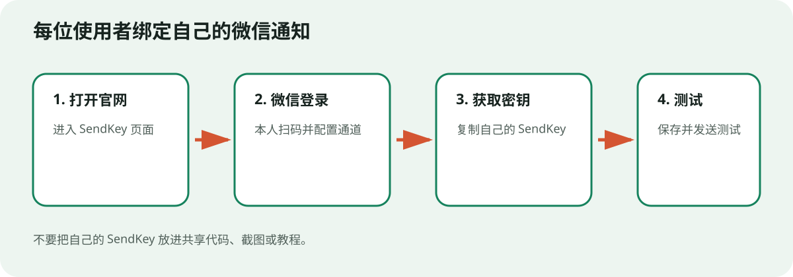
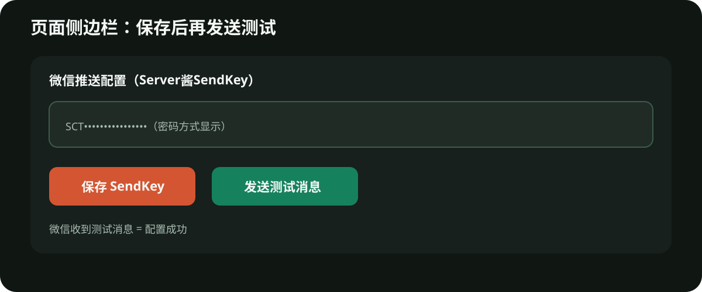

# 微信手机通知绑定图文教程

本项目可通过 Server酱把监控结果发送到使用者自己的微信。每位使用者都应申请自己的 SendKey；项目发布者不需要、也不应该把自己的 SendKey 交给别人。

## 第一步：申请自己的 SendKey

1. 打开 [Server酱 SendKey 页面](https://sct.ftqq.com/sendkey/)。
2. 使用本人微信扫码登录。
3. 按页面提示完成消息通道配置。
4. 在 SendKey 页面生成或复制以 `SCT` 开头的 SendKey。

> 上图是操作流程示意图，不是 Server酱官方页面截图；实际按钮名称以官网为准。

## 第二步：填入本系统

1. 启动页面并打开 `http://localhost:8501`。
2. 在左侧找到“微信推送配置（Server酱SendKey）”。
3. 把自己的 SendKey 粘贴到密码输入区域。
4. 点击“保存 SendKey”。
5. 点击“发送测试消息”。
6. 微信收到测试消息，即表示绑定成功。

如果需要通知多个微信账号，每个账号分别申请自己的 SendKey，并按页面提示一行填写一个。

## 收不到测试消息怎么办

按下面顺序排查：

1. 确认已经点击“保存 SendKey”，而不只是粘贴在输入框里。
2. 确认 SendKey 没有多余空格、换行或缺少字符。
3. 回到 Server酱官网确认微信通道已启用。
4. 查看本系统运行日志，区分“网络失败”“密钥无效”和“服务额度限制”。
5. 查看 Server酱官网当前套餐和发送额度；额度规则可能调整，以官网实时说明为准。
6. 重新生成 SendKey 后再次测试。

## 安全提醒

- SendKey 等同于通知发送权限，不要发给其他人。
- 不要把 SendKey 写进代码、截图、教程、公开仓库或日志。
- 每位新使用者都应重新绑定自己的微信。
- 怀疑泄露时，立即在 Server酱页面重置 SendKey，并更新本地配置。
- 分享项目时只保留空白示例，不分享自己的 `config.json`。

监控提醒应至少包含日期、出发和到达城市、三字码、完整航班号、票价类型、票面价和检测时间。收到提醒后，请到官方渠道自行核验。

## 官方参考

- [Server酱 SendKey 获取说明](https://sct.ftqq.com/docs/getting-started/sendkey/)
- [Server酱 SendKey 页面](https://sct.ftqq.com/sendkey/)
